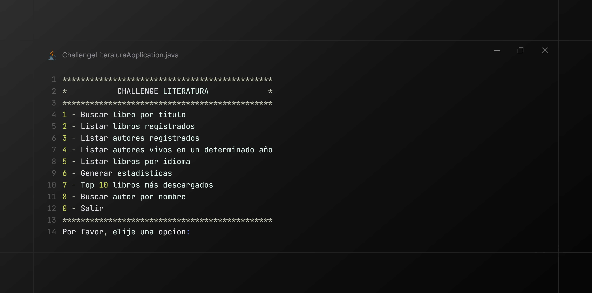
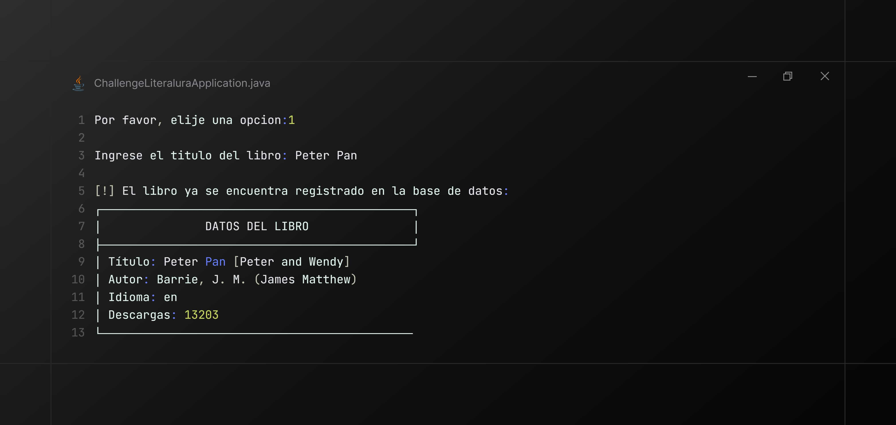
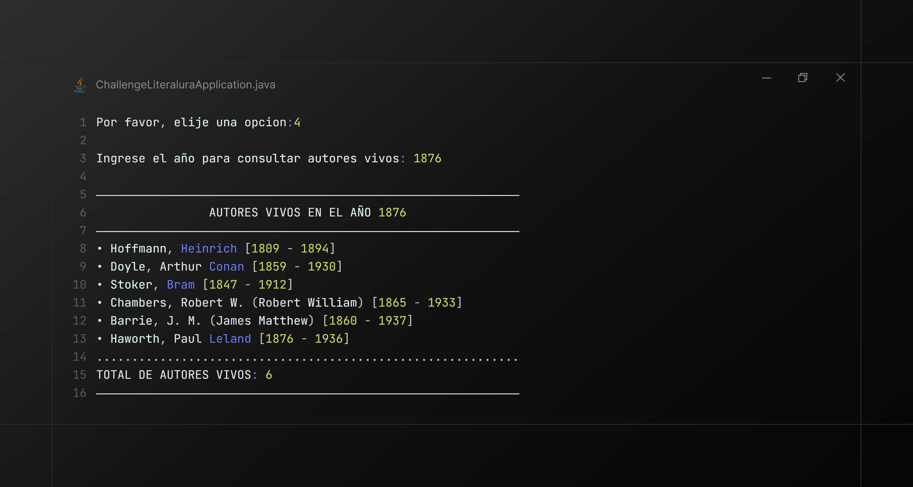
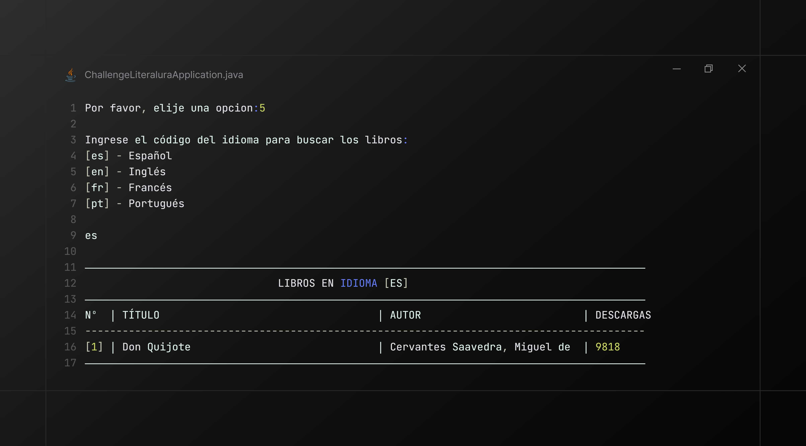
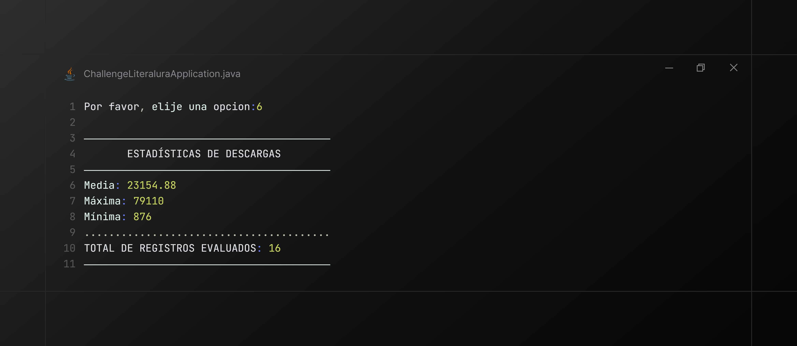
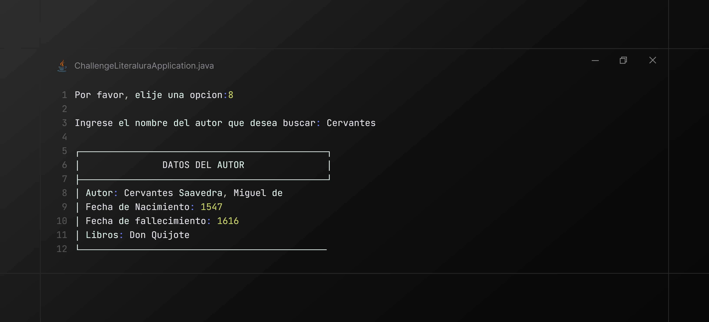

# 📚_challenge Springboot Literalura

Este proyecto es un desafío de programación que consiste en construir un sistema de gestión de libros y autores. La aplicación permite interactuar mediante una interfaz de consola para buscar libros en la API pública de **Gutendex**, almacenar los resultados en una base de datos relacional y realizar consultas estadísticas y de filtrado.

## ✨ Funcionalidades del Sistema

- **Búsqueda por Título:** Localiza libros directamente desde la API Gutendex y los registra en la base de datos local.
- **Listar Libros Registrados:** Muestra todos los libros que han sido buscados y almacenados previamente.
- **Listar Autores:** Genera un listado de los autores registrados, evitando duplicidad de datos.
- **Autores Vivos en Determinado Año:** Filtra autores que estaban activos en un año específico ingresado por el usuario.
- **Estadísticas por Idioma:** Cuenta y muestra la cantidad de libros disponibles en la base de datos según el idioma seleccionado (ES, EN, FR, PT).
- **Generar estadísticas:** (Extra) Visualiza estadisticas de los libros descargados
- **Top 10 Libros:** (Extra) Visualiza los libros más descargados utilizando Java Streams y consultas personalizadas.
- **Buscar autor por nombre:** (Extra) Muestra la información del autor buscado

## 🛠️ Tecnologías y Entorno de Desarrollo

Este proyecto fue construido utilizando herramientas modernas del ecosistema Java:

* **Lenguaje:** Java 25 (LTS).
* **Framework:** Spring Boot 4.0.1 (o superior).
* **Gestor de Dependencias:** Maven.
* **Base de Datos:** MySQL.
* **Persistencia:** Spring Data JPA.
* **Consumo de API:** HttpClient, HttpRequest y HttpResponse (Java Native).
* **Mapeo JSON:** Jackson (incluido en Spring Boot).

### **Dependencias Principales**
- `Spring Data JPA`: Para el mapeo objeto-relacional y gestión de la BD.
- `MySQL Driver`: Conector para la base de datos.
- `Spring Boot DevTools`: Para mejorar el flujo de desarrollo.

## 📸 Demostración del Proyecto
A continuación, se presenta una visión general del funcionamiento de **Challenge de Literalura**, mostrando la integración con la API de Gutendex y la persistencia de datos en la base de datos local.

### 🖼️ Capturas de Pantalla Detalladas

#### 0. Menú Principal y Bienvenida
Interfaz de consola que presenta las 5 opciones principales del desafío y las funcionalidades extra de estadísticas.



#### 1. Búsqueda de Libros por Título
Demostración de la búsqueda asíncrona a la API. Se muestra cómo el sistema detecta si el libro ya existe en la base de datos para evitar duplicados.




#### 2. Listar Libros Registrados
Visualización de todos los libros almacenados en la base de datos local con su autor e idioma.


#### 3. Listar Autores Registrados
Muestra la lista de autores con sus fechas biográficas y los libros asociados en formato de ficha técnica.


#### 4. Listar Autores Vivos en un Año
Filtro avanzado para localizar autores vivos en un periodo de tiempo específico.



#### 5. Listar Libros por Idioma
Búsqueda filtrada por códigos de idioma (ES, EN, FR, PT).



#### 6. Visualización de Estadísticas
Uso de `DoubleSummaryStatistics` para mostrar promedios, máximos y mínimos de descargas.



#### 7. Top 10 Libros más Descargados
Ranking de popularidad basado en el conteo de descargas de la base de datos.


#### 8. Buscar Autor por Nombre
Búsqueda directa de autores específicos almacenados previamente.



### 🎬 Video Demostración Completa
Funcionamiento: desde la búsqueda de un libro nuevo, la gestión de errores (como libros inexistentes o entradas inválidas), hasta la consulta de autores vivos en años específicos.


[📥 Descargar Demostración en Video](assets/video/challenge-literatura.mp4)

## 🚀 Configuración y Ejecución

1. **Clonar el repositorio:**
   ```bash
   git clone [https://github.com/tu-usuario/challenge-literalura.git](https://github.com/tu-usuario/challenge-literalura.git)
   cd_challenge-literalura